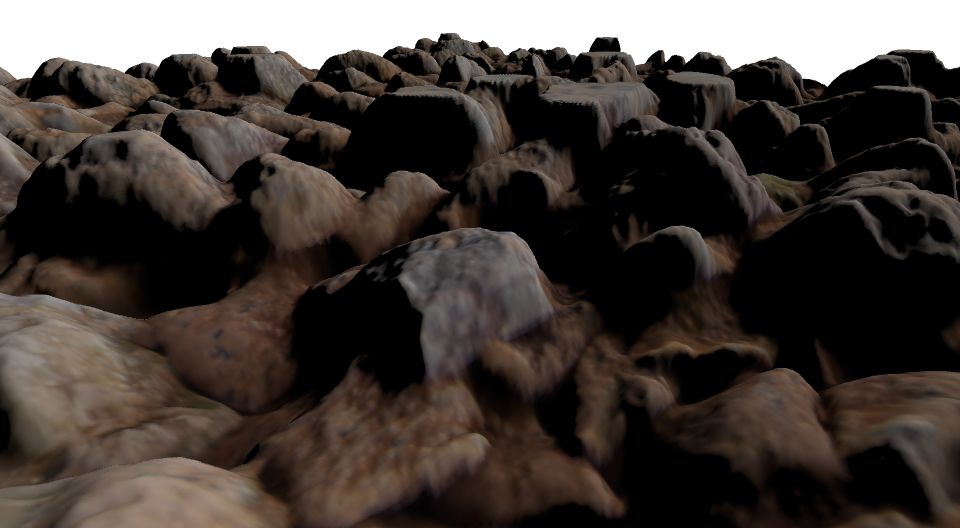
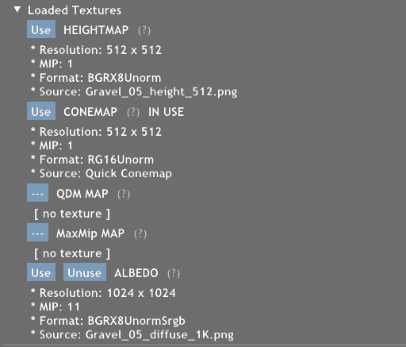
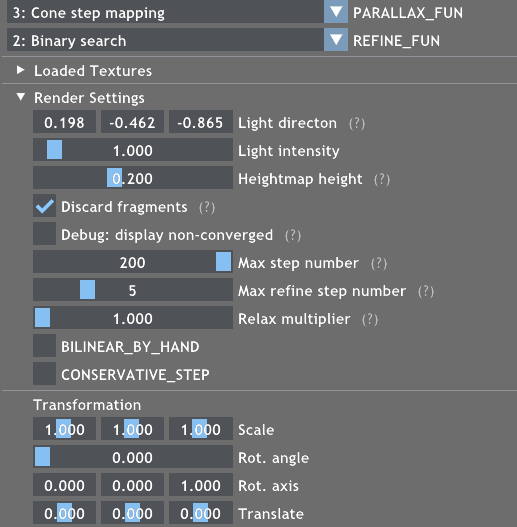
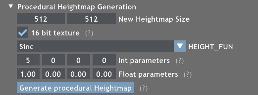
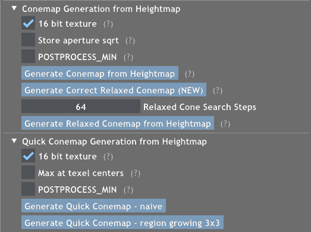
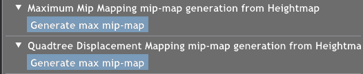

# Robust Cone Step Mapping

## The Parallax Project



This project (https://github.com/Bundas102/robust-cone-map) was created as a sample application in Falcor 7.0. The application contains the implementation for the Eurographics Symposium on Rendering 2024 paper: *Robust Cone Step Mapping*, Róbert Bán, Gábor Valasek, Csaba Bálint, and Viktor A. Vad, https://diglib.eg.org/handle/10.2312/sr20241146
```
@inproceedings{10.2312:sr.20241146,
   booktitle = {Eurographics Symposium on Rendering},
   editor =    {Haines, Eric and Garces, Elena},
   title =     {{Robust Cone Step Mapping}},
   author =    {Bán, Róbert and Valasek, Gábor and Bálint, Csaba and Vad, Viktor A.},
   year =      {2024},
   publisher = {The Eurographics Association},
   ISSN =      {1727-3463},
   ISBN =      {978-3-03868-262-2},
   DOI =       {10.2312/sr.20241146}
}
```

The project builds upon a [previous code base](https://github.com/Bundas102/falcor-conemap) for our Eurographics 2022 Short Paper: *Quick cone map generation on the GPU*, G&aacute;bor Valasek and R&oacute;bert B&aacute;n.


## Building and running the project
The project uses [Falcor 7.0](https://github.com/NVIDIAGameWorks/Falcor/tree/7.0). We tested on Windows 10/11 with Visual Studio 2022 and the DirectX 12 backend, we will assume this setup for the rest of the guide.
- Copy [Falcor 7.0](https://github.com/NVIDIAGameWorks/Falcor/tree/7.0) into a folder (we will refer to this folder as `Falcor`)
- Copy this project into `Falcor > Source > Samples > Parallax`
- Add the following line to `Falcor > Source > Samples > CMakeLists.txt`: 
```
add_subdirectory(Parallax)
```
- Follow the instructions in Falcor's [README](https://github.com/NVIDIAGameWorks/Falcor/blob/7.0/README.md) to generate the Visual Studio solution

- Open `Falcor > build > windows-vs2022 > Falcor.sln` with Visual Studio
- Change the Startup Project to `Samples > Parallax` in the Solution Explorer
- Build & Run &ndash; this should also build all dependencies (we have experienced some problems witht Falcor's dependency system, so a full build might be necessary)


## Overview


- The project renders a single square (two triangles) and uses parallax mapping techniques to apply a height map to achieve a detailed surface.
- The program handles multiple textures at once: a height map, a cone map / QDM map / MaxMip map and, an albedo/diffuse texture.
Usually one of the textures is used at any time for parallax mapping.
- The height map can be loaded from an image file, or it can be generated procedurally from a height function.
- The cone map, QDM map, and MaxMip map can be generated from the height map.

## Render Settings


Rendering is done by a primary search and then a refinement phase. See [Displacement Mapping on the GPU &mdash; State of the Art](https://doi.org/10.1111/j.1467-8659.2007.01108.x) for an overview.

The primary search is defined by `PARALLAX_FUN`:
- *0: Bump mapping* &ndash; no search
- *1: Parallax mapping* &ndash; a single parallax step
- *2: Linear search* &ndash; uniformly divide the ray interval into `Max step number` parts
- *3: Cone step mapping* &ndash; uses the cone map for space skipping
- *4: Seidel's Maximum Mip tracing*
- *5: Drobot's QDM tracing*

The refinement is defined by `REFINE_FUN`:
- *0: No refinement*
- *1: Linear approx* &ndash; assumes the surface is linear between the last two steps
- *2: Binary search* &ndash; halves the interval between the last two steps `Max refine step number` times

The `CONSERVATIVE_STEP` checkbox enables our Cell max tracing which changes the minimum step according to the cone map texels if cone step mapping is used. See our paper for details.

## Procedural height map generation


The generated heightmap is created from a height function defined in `ProceduralHeightmap.cs.slang`. Select the used function with `HEIGHT_FUN`. 

The project contains two functions by default, but feel free to create your own:
1. Write the height function mapping [0,1]&sup2; texture coordinates to [0,1] height values &ndash; in `ProceduralHeightmap.cs.slang`
2. Extend the preprocessor switch with the new entry &ndash; in `ProceduralHeightmap.cs.slang`
3. Extend the GUI list `kHeightFunList` with the new function  &ndash; in `Parallax.cpp`

## Cone map generation


Create a cone map from the loaded height map. The cone map is selected for use upon generation, but the render method does not change automatically, so you might have to set `PARALLAX_FUN` in *Render Settings* to `3: Cone step mapping` to make use of the cone map.
The buttons in order are
- Dummer's conemap (bruteforce generation)
- Our new corrected relaxed conemap. See our paper for details.
- Policarpo et al.'s relaxed conemap
- Our previous quick conemap generation (conservative)

The `POSTPROCESS_MIN` checkbox enables our bilinear correction postprocess step for conemap generation. See our paper for details.



Maximum Mip mapping and QDM are implemented for comparison. The generated texture is selected for use automatically but the rendering method needs to be changed accordingly to `4: Seidel's Maximum Mip tracing` or `5: Drobot's QDM tracing`.

## Load image


Load a height map or an albedo texture from an image file. The height values are expected to be in the red channel of the texture.
